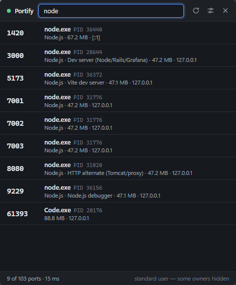
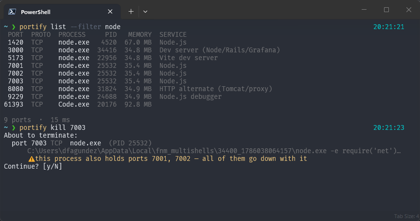
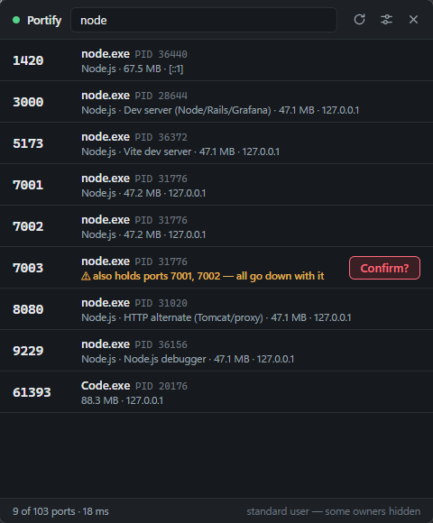
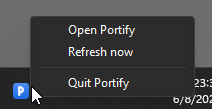

# Portify

**See every port in use, and take one back with a click.**

You know the drill: `EADDRINUSE: address already in use :::3000`. Then `netstat -ano | findstr 3000`, squint at a PID, `taskkill /PID 12841 /F`. Three commands and a visual lookup, ten times a day.

Portify replaces that with:

```console
$ portify kill 3000
✔ port 3000 freed: node (PID 12841) terminated
```

…or one click in the desktop app.



## What it is

Two front ends over one engine:

- **`portify`** — a CLI. One binary, no runtime, under 1 MB, a scan takes about 10 ms.
- **Portify** — a desktop app that lives in the system tray. Search, click, port is free.

Both are built from the same Rust core, so they can never disagree about what a port is or what killing one means.

## Status

Portify is at **0.1.0** and is a ground-up Rust rewrite of an earlier Python version. Being straight about where it stands:

| | State |
|---|---|
| CLI | Tested by hand on Windows and Linux; compiles clean for macOS |
| Desktop app | Verified by hand on Windows 11: tray, hotkey, list, filter, kill with confirmation, force-kill, notifications, settings persistence, single instance |
| Windows | Primary target. CLI and app both verified end to end |
| macOS | Same code paths, **not yet run on a Mac** |
| Linux | CLI tested; the desktop app is built by CI but not hand-tested |
| Installers | Built by CI, **not code-signed** — expect a SmartScreen/Gatekeeper warning |
| Package managers | Scoop (CLI, from this repo's bucket). winget and Homebrew not submitted yet |

## Install

Nothing to build and no runtime to install — every binary below is prebuilt and
self-contained. They are **not code-signed**, so Windows shows a SmartScreen
warning ("More info → Run anyway") and macOS a Gatekeeper one.

### Desktop app

Download from [the latest release](https://github.com/dfagundez/portify/releases/latest):

| Platform | File |
|---|---|
| Windows | `Portify_x.y.z_x64-setup.exe` (or the `.msi` for deployment) |
| macOS, Apple silicon | `Portify_x.y.z_aarch64.dmg` |
| macOS, Intel | `Portify_x.y.z_x64.dmg` |
| Linux | `Portify_x.y.z_amd64.AppImage`, or the `.deb` |

### CLI

**Scoop** (Windows) — this repository is the bucket, so there is nothing else to add:

```powershell
scoop bucket add portify https://github.com/dfagundez/portify
scoop install portify
```

Everywhere else, download the binary:

```bash
# Linux
curl -sL https://github.com/dfagundez/portify/releases/latest/download/portify-cli-linux-x86_64.tar.gz | tar xz
sudo mv portify /usr/local/bin/

# macOS, Apple silicon (use portify-cli-macos-x86_64.tar.gz on Intel)
curl -sL https://github.com/dfagundez/portify/releases/latest/download/portify-cli-macos-aarch64.tar.gz | tar xz
sudo mv portify /usr/local/bin/
```

On Windows, unzip `portify-cli-windows-x86_64.zip` and put `portify.exe` anywhere on your `PATH`.

`/usr/local/bin` rather than `~/.local/bin` or `~/.cargo/bin` on purpose: `sudo`
replaces your `PATH` with a fixed `secure_path`, so a `portify` in your home
directory works but `sudo portify` reports `command not found` — and reaching
other users' processes is exactly what you need `sudo` for.

Optional tab-completion — `portify completions <shell>` prints the script for
bash, zsh, fish, PowerShell or Elvish. Where it goes depends on your setup:

```bash
# zsh with oh-my-zsh, prezto or any framework that runs compinit for you
portify completions zsh > "${ZSH_CACHE_DIR:-$HOME/.oh-my-zsh/cache}/completions/_portify"

# plain zsh — the fpath line must come *before* your `compinit` call
mkdir -p ~/.zsh/completions
portify completions zsh > ~/.zsh/completions/_portify
# then in ~/.zshrc, above compinit:  fpath=(~/.zsh/completions $fpath)

# bash
portify completions bash | sudo tee /etc/bash_completion.d/portify >/dev/null

# fish
portify completions fish > ~/.config/fish/completions/portify.fish
```

zsh caches its completion index, so delete `~/.zcompdump*` and open a new shell
if nothing happens on the first try.

### From source

Needs [Rust](https://rustup.rs) 1.95+. For the app, also [Node](https://nodejs.org) 20.19+ (Vite 7's floor; CI builds on 22).

From a checkout of this repository:

```bash
# CLI
cargo install --path crates/portify-cli

# Desktop app
cd app && npm install && npm run tauri build
```

Note that `cargo install` puts the binary in `~/.cargo/bin`, which `sudo` cannot
see — copy it to `/usr/local/bin` if you need elevated scans.

Platform prerequisites for the desktop app:

- **Windows** — [WebView2](https://developer.microsoft.com/microsoft-edge/webview2/) (already present on Windows 10/11) and the MSVC build tools **with the C++ workload** — the `Microsoft.VisualStudio.2022.BuildTools` winget package alone installs no compiler and no linker, and the build fails with `linker link.exe not found`. See [docs/TESTING-WINDOWS.md](docs/TESTING-WINDOWS.md#the-msvc-linker).
- **macOS** — Xcode command line tools.
- **Linux** — `libwebkit2gtk-4.1-dev libgtk-3-dev libayatana-appindicator3-dev librsvg2-dev patchelf`.

## CLI

```console
$ portify
 PORT  PROTO  PROCESS       PID    MEMORY  SERVICE
 3000  TCP    node       753572  236.7 MB  Dev server (Node/Rails/Grafana)
 5432  TCP    postgres     4410   28.1 MB  PostgreSQL
 6379  TCP    redis-server 4711   12.3 MB  Redis

 3 ports  ·  7 ms
```

One row per port, not one per socket: a dev server binding IPv4 and IPv6 on three interfaces is one line, the way you think about it.

Outbound UDP client sockets — a browser on QUIC, a VPN agent phoning home — are
hidden by default. They sit on OS-assigned ephemeral ports, nobody is ever trying
to free one, and on Windows they outnumber real listeners about two to one.
`--all` shows them; naming a port explicitly (`portify 54995`) always finds it.

### Commands

| Command | What it does |
|---|---|
| `portify` | List every port in use |
| `portify 3000` | Show what is holding port 3000 |
| `portify kill 3000` | Free port 3000 |
| `portify kill 3000 8080 -y` | Free several ports, no prompt |
| `portify kill --pid 12841` | Kill a specific process |
| `portify watch` | Live view, refreshed on an interval |
| `portify info` | Host details and whether you are elevated |
| `portify completions <shell>` | Shell completion script |

Bare numbers are **ports**, never PIDs. Killing by PID is always explicit via `--pid`, so a typo can't take down an unrelated process.

### Options worth knowing

```bash
portify list --all           # everything: established connections and outbound UDP sockets
portify list --filter node   # match process name, path or command line
portify list --proto udp     # one protocol
portify list --raw           # one row per socket instead of per port
portify list --wide          # show full command lines
portify list --json          # machine-readable, stable shape
portify kill 3000 --force    # skip SIGTERM, go straight to SIGKILL
```

Filters compose — `portify list --filter node --proto tcp 3000` means all three
at once, not whichever one wins. Ports are bare arguments, so `portify list 3000 8080`
narrows to those two.

`list`, `kill` and `watch` also answer to `ls`, `k` and `w`.



### Exit codes

| Code | Meaning |
|---|---|
| 0 | Success |
| 2 | Nothing found |
| 3 | Permission denied |
| 4 | Bad input |
| 5 | Internal error |

```bash
portify 3000 >/dev/null || echo "port 3000 is free"
```

## Desktop app

Lives in the tray. Left-click the icon to show or hide the window; right-click for the menu.

- **`Ctrl+Alt+P` from anywhere** shows or hides the window, even when Portify has no focus
- Every port in use, one row each, refreshed on your interval
- Type to filter by port, process, PID, service or command line
- **Kill** on any row — a second click confirms, shift-click skips the confirmation and force-kills
- No taskbar button: the window comes and goes, the tray icon stays
- Closing the window hides it; the app quits from the tray menu only
- Follows your system light/dark theme

### Killing is deliberate

The first click arms the row, the second confirms — and in between, Portify tells
you what *else* goes down with it. One process fronting several ports is common
(a WSL relay, a reverse proxy, a dev server with a debugger attached), so "free
port 7003" can quietly mean "drop three of them".



Shift-click skips the confirmation and force-kills immediately.

### From the tray



Settings (sliders icon, stored in your OS config directory):

| Setting | Default |
|---|---|
| Refresh interval | 5 s (or manual) |
| Show / hide shortcut | `Ctrl+Alt+P` (editable, or empty to disable) |
| Notify on kill result | on |
| Ask before killing | on |
| Include established connections | off |
| Hide window when it loses focus | off |

## WSL

Portify only sees the operating system it is running in, and WSL2 is a separate
one with its own network stack.

Run it **on Windows** and your WSL services do appear — but as `wslrelay.exe`,
the bridge Windows runs to forward `localhost` into the VM. Killing that frees
the Windows side of the port without touching the process inside Linux, and one
relay usually fronts *every* forwarded port at once. Portify warns you before
that happens.

To manage the real processes, install the Linux CLI inside your distribution too
— it is a separate install from the Windows one, and the two do not conflict:

```bash
# Inside WSL
curl -sL https://github.com/dfagundez/portify/releases/latest/download/portify-cli-linux-x86_64.tar.gz | tar xz
sudo mv portify /usr/local/bin/
```

Most WSL users end up with both: the desktop app for native Windows ports, and
`portify` inside the distribution for everything running in Linux.

## Permissions

Portify can only see and kill what your user account can.

- **Windows** — ports owned by other users, services, or elevated processes show as `(hidden)` with no PID. Run Portify as Administrator to see and kill them.
- **macOS / Linux** — same, with `sudo`.

`portify info` tells you which side of that line you are on. Portify never asks for elevation on your behalf and never escalates silently.

### Safety rules

Portify refuses to kill:

- itself
- PID 0
- PID 1 (init) on Unix, PID 4 (System) on Windows

A graceful kill sends SIGTERM, waits, and escalates to SIGKILL only if the process ignores it — because "the kill succeeded but the port is still taken" is the one outcome this tool must never produce. On Windows, where there is no SIGTERM, both modes are a single `TerminateProcess`.

## How it is built

```
portify/
├── crates/
│   ├── portify-core/     Scanning, grouping, killing, service catalogue
│   └── portify-cli/      The `portify` binary (clap)
├── app/
│   ├── src/              Frontend: TypeScript, no framework (24 KB built)
│   └── src-tauri/        Tauri v2 shell: tray, window, IPC commands
├── assets/               Icon sources
└── scripts/              generate-icon.mjs — regenerates the icons
```

`portify-core` has no UI and no async: a full scan is milliseconds, so callers just call it on a timer. Sockets come from [`netstat2`](https://crates.io/crates/netstat2), process identity from [`sysinfo`](https://crates.io/crates/sysinfo).

## Roadmap

Planned work lives in issues labelled
[`roadmap`](https://github.com/dfagundez/portify/issues?q=is%3Aissue+is%3Aopen+label%3Aroadmap).
React with 👍 on what you want — that ordering is what decides the next build.

- **[See WSL ports from the Windows app](https://github.com/dfagundez/portify/issues/2).** Detect WSL, query Portify inside the
  distribution, and show both sets of ports in one list, labelled by origin.
- **[Name the service inside `svchost.exe`](https://github.com/dfagundez/portify/issues/3).** Windows hosts dozens of unrelated
  services in copies of one executable; asking the service control manager which
  ones live in a PID turns twenty identical rows into useful information.
- **[Signed installers](https://github.com/dfagundez/portify/issues/4).** Removing the SmartScreen and Gatekeeper warnings needs
  a code-signing certificate.

## Contributing

See [CONTRIBUTING.md](CONTRIBUTING.md). In short: `cargo test --workspace`, `cargo clippy --workspace --all-targets`, `cargo fmt --all`, and build the frontend before touching the app crate.

## License

MIT — see [LICENSE](LICENSE).
